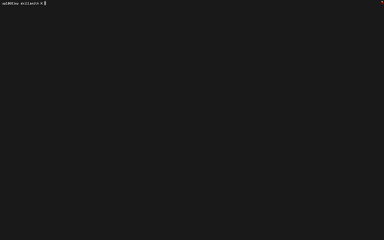

<p align="center">
  <strong>Skillsmith</strong>
</p>

<p align="center">
  Generate AI coding rules from any GitHub repo. Built for Cursor, Claude Code, Copilot, Codex, and friends.
</p>

<p align="center">
  <a href="https://www.npmjs.com/package/skillsmith"></a>
  <a href="./LICENSE"></a>
  <a href="https://github.com/Megasley/skillsmith/stargazers"></a>
</p>

<p align="center">
  <a href="#examples">Examples</a>
  ·
  <a href="#cli">CLI</a>
  ·
  <a href="https://skillsmith.vercel.app">Web</a>
  ·
  <a href="#docs">Docs</a>
</p>

<br />

<p align="center">
  
  <br />
  <sub><em>CLI demo — <code>npx skillsmith</code> on a sample repo</em></sub>
</p>


> [!NOTE]
> **Most AI coding tools fail on real codebases** because they don’t know your project’s conventions. Skillsmith reads your repo, extracts the conventions, and generates rules files your assistant can actually use.

## Quick start

```bash
export ANTHROPIC_API_KEY=sk-ant-...   # or OPENAI_API_KEY; Ollama needs no key
npx skillsmith . --yes
```

That analyzes the current directory and writes **`.claude/CLAUDE.md`** (Claude Code layout), `.cursorrules`, `AGENTS.md`, and `.github/copilot-instructions.md`. By default it also writes **task subagents**: **`agents.json`**, **`.claude/agents/*.md`** (Claude Code), and optionally **`.cursor/rules/skillsmith-*.mdc`** if you pass **`--cursor`**. Point at a remote repo with `npx skillsmith vercel/ai-chatbot --yes`.

### Claude Code file layout & `--scope`

[Claude Code](https://docs.anthropic.com/en/docs/claude-code) expects project instructions under **`.claude/`**. Skillsmith defaults to:

| Scope | CLI flag | Output path | When to use |
| --------|----------|-------------|-------------|
| **project** (default) | `--scope=project` | `{output}/.claude/CLAUDE.md` | Team-shared rules in the repo; commit this path. |
| **global** | `--scope=global` | `~/.claude/CLAUDE.md` | Personal defaults on your machine across projects (CLI only; not tied to `--output-dir`). |
| **local** | `--scope=local` | `{output}/.claude/CLAUDE.local.md` | Personal overrides for one checkout; **add to `.gitignore`** so they are not committed. |

The CLI creates **`.claude/`** under the output directory when needed. Global scope writes to your home directory and still analyzes the target repo you pass (e.g. `skillsmith --scope=global . --yes`).

## Features

- **Local or GitHub** — analyze a folder or `owner/repo` / full GitHub URL (optional `GITHUB_TOKEN` for rate limits).
- **Four rule adapters** — `.claude/CLAUDE.md` (Claude Code), `.cursorrules`, `AGENTS.md`, `.github/copilot-instructions.md` (Copilot).
- **Task subagents** — LLM-generated **Claude Code** agent files under **`.claude/agents/`**, a portable **`agents.json`** manifest, and optional **Cursor** **`.mdc`** rules (`--cursor`). Schema: [`docs/agents-schema.md`](./docs/agents-schema.md).
- **`compile` command** — re-emit **Cursor** or **Claude Code** files from an existing **`agents.json`** without re-running analysis (`skillsmith compile --from agents.json --target cursor`).
- **Multi-provider** — Anthropic (default), OpenAI, or local **Ollama**.
- **Detects existing tooling** — skips redundant outputs when your repo already declares Cursor / Claude / Copilot rules (override with `--formats`).
- **Cost preview** — estimated spend before the LLM runs.
- **No backend dependency** — stateless CLI; no telemetry, no code stored on our servers.

## API keys

Skillsmith uses **your** Anthropic, OpenAI, or local Ollama setup. That means:

- Your repo snapshot is sent **only** to the provider you choose — not through Skillsmith-hosted inference.
- You pay **your** provider directly (roughly **~$0.20** per typical run on Claude-class models) — no markup, no subscription to us.
- The tool keeps working even if our website is down: the **CLI** is the source of truth.

Get a key at [console.anthropic.com](https://console.anthropic.com) or [platform.openai.com](https://platform.openai.com). For free, local runs, install [Ollama](https://ollama.com) and a model such as `llama3.1`.

## Examples

We ship **real outputs** from running Skillsmith on five public repos (Next.js app, UI monorepo, FastAPI, Rails, Hono) in [`examples/`](./examples/). Use them to judge tone and specificity before you run it yourself.

From the [shadcn-ui/ui](./examples/shadcn-ui-ui/) example — notice paths and stack detail, not generic advice:

```markdown
### Layout and architecture

The repo is a Turborepo monorepo; the main app lives under apps/v4. Inside apps/v4/app
the Next.js App Router route groups are used heavily: (app) wraps authenticated/app routes,
(create) is a parallel or layout group that re-exports from (app)/create/lib via simple
star-export shims (e.g. apps/v4/app/(create)/lib/fonts.ts). Feature areas like 'sera'
live under (app)/(styles)/sera/ and each feature gets its own directory with an index.tsx
entry point and a components/ subdirectory. Shared UI primitives are imported from @/styles/*
path aliases (e.g. @/styles/base-sera/ui/separator, @/styles/radix-nova/ui/field).
```

See [`examples/README.md`](./examples/README.md) for the full table, reproducibility notes, and generation metadata.

## CLI

### Commands

| Command | Description |
| --------|------------- |
| `skillsmith` / `skillsmith generate [target]` | Analyze a **local directory** (default `.`) or **GitHub** (`owner/repo`, `https://github.com/...`), write rule files and **subagent outputs** (unless disabled). Default subcommand. |
| `skillsmith compile` | Read **`agents.json`** and write **only** subagent files for **`--target cursor`** or **`claude-code`** (no LLM, no repo fetch). |
| `skillsmith init` | Interactive wizard: writes `~/.skillsmith/config.json` (provider, optional API key, default formats, default output dir). |
| `skillsmith formats` | Print supported **adapter** IDs for `-f` / `--formats`. |

Flags that start with `-` without a subcommand are treated as **`generate`** flags (e.g. `skillsmith -y .`). Run **`skillsmith --help`** or **`skillsmith generate --help`** for the full option list and examples.

### `generate` flags

| Flag | Description |
| -----|------------- |
| `-k, --api-key <key>` | API key for Anthropic/OpenAI; overrides env and config file. |
| `-p, --provider <name>` | `anthropic` (default), `openai`, or `ollama`. |
| `-f, --formats <csv>` | Comma-separated **rule adapters**: `claude-md`, `cursorrules`, `agents-md`, `copilot`. Invalid tokens are ignored; if none left, all are used. |
| `-o, --output-dir <dir>` | Where to write files (relative to current working directory). |
| `-y, --yes` | Skip the cost / continue confirmation. |
| `--json` | Machine-readable summary on stdout (includes `files`, `subagents`, `subagentsSummary`). |
| `-q, --quiet` | Less noise; main writes and subagent summary still print. |
| `--scope <mode>` | `project` (default), `global`, or `local` — see [Claude Code file layout](#claude-code-file-layout--scope). |
| `--no-reduce` | Skip post-extract rule reduction on `things_to_avoid`. |
| `--no-subagents` | Skip LLM subagent **definition** generation (task patterns still detected). |
| `--no-subagent-output` | Do not write `.claude/agents/`, `agents.json`, or Cursor `.mdc` files. |
| `--cursor` | When writing subagents, also write `.cursor/rules/skillsmith-*.mdc`. |
| `--debug` | During rule reduction, print removed rules and reasons to stderr. |

### `compile` flags

| Flag | Description |
| -----|------------- |
| `--from <path>` | Path to `agents.json` (default: `agents.json` in cwd). |
| `--target <name>` | **`cursor`** (`.mdc` under `.cursor/rules/`) or **`claude-code`** (`.md` under `.claude/agents/`). Required. |
| `-o, --output-dir <dir>` | Treat as project root for output paths (default: directory containing `--from`). |
| `--json` | Print JSON with `files`, `agentCount`, etc. |
| `-q, --quiet` | Minimal stdout. |

### Config file

Path: **`~/.skillsmith/config.json`** (created by `skillsmith init`).

| Field | Type | Description |
| -------|------|-------------|
| `provider` | string | `anthropic`, `openai`, or `ollama`. |
| `apiKey` | string | Optional; stored locally. Prefer env vars for CI. |
| `formats` | string[] | Default format IDs when `--formats` is omitted. |
| `outputDir` | string | Default output directory (relative to cwd). |

Precedence: **CLI flags → environment variables → config file → defaults.**

### Environment variables

| Variable | Purpose |
| ---------|---------|
| `ANTHROPIC_API_KEY` | Anthropic API key. |
| `OPENAI_API_KEY` | OpenAI API key. |
| `ANTHROPIC_MODEL` | Optional model override (Anthropic). |
| `OPENAI_MODEL` | Optional model override (OpenAI). |
| `SKILLSMITH_PROVIDER` | Default provider if not set via flag or config. |
| `GITHUB_TOKEN` | Optional; higher rate limits when fetching public GitHub archives. |
| `OLLAMA_HOST` / `OLLAMA_BASE_URL` | Ollama base URL (default `http://localhost:11434`). |
| `OLLAMA_MODEL` | Ollama model name override. |

## Web

The hosted app mirrors the same **`@skillsmith/core`** pipeline as the CLI: **[skillsmith.vercel.app](https://skillsmith.vercel.app)**. After a successful run it shows **Subagents** (Claude `.md` previews, **`agents.json`**, optional Cursor `.mdc` when enabled) below the main output tabs. Use the UI for exploration; use the CLI for scripts, CI, or air‑gapped workflows (with Ollama).

## How it works

1. **Inventory** — Infer stack from the file tree and manifests (package files, lockfiles, etc.).
2. **Sample** — Select representative source files (caps on count and size).
3. **Extract** — LLM pass: conventions, naming, patterns, things to avoid — grounded in the sample.
4. **Subagents** (optional) — From detected task patterns, LLM defines **Claude Code–style** subagents; compiled to **`.claude/agents/*.md`**, **`agents.json`**, and optionally **`.cursor/rules/*.mdc`**.
5. **Synthesize** — Render each chosen adapter (`.claude/CLAUDE.md`, Cursor rules, etc.) from the structured result.

```text
  ┌──────────┐     ┌────────┐     ┌─────────┐     ┌──────────┐     ┌─────────────┐
  │ Inventory│ ──► │ Sample │ ──► │ Extract │ ──► │ Subagents│ ──► │ Synthesize  │
  │  (LLM)   │     │ (code) │     │  (LLM)  │     │  (LLM)   │     │ (adapters)  │
  └──────────┘     └────────┘     └─────────┘     └──────────┘     └──────┬──────┘
       (skip subagent LLM with --no-subagents)                               │
                                                                             ▼
                    .claude/CLAUDE.md / .cursorrules / AGENTS.md / Copilot
                    + agents.json + .claude/agents/ (+ optional .cursor/rules/)
```

## Docs

- Architecture and package layout: **[docs/README.md](./docs/README.md)**  
- **`agents.json` schema** and **`compile` targets**: **[docs/agents-schema.md](./docs/agents-schema.md)**

## Provider quality

Honest take: **quality tracks the model.** All providers share the same prompts and pipeline.

| Provider | Notes |
| ---------|-------|
| **Anthropic** (Claude Sonnet class) | Best default for nuance, path‑specific output, and JSON reliability. |
| **OpenAI** (`gpt-4o` and similar) | Close second; strong for many codebases. |
| **Ollama** (local) | Weakest and most variable; fine for experimentation or offline use. Expect more generic text unless you use a large capable model. |

## FAQ

**Why does this need an API key?**  
Skillsmith doesn’t host an LLM. The key lets **your** account call Anthropic or OpenAI. Ollama needs no key.

**Is my code sent anywhere?**  
To **your chosen LLM provider** (or your local machine for Ollama). Not to Skillsmith for inference. The web app runs the same logic server‑side for your session — check that deployment’s privacy policy if you use it.

**How is this different from asking ChatGPT?**  
Skillsmith systematically walks **your tree**, merges manifests + samples, and writes **repeatable, file‑shaped rules** (e.g. `.claude/CLAUDE.md`) tuned to adapters — not a one‑off chat answer.

**Can I use this on private or proprietary repos?**  
Yes, locally: `skillsmith /path/to/repo`. Don’t commit secrets; treat API keys like any other dev credential.

**How often should I regenerate?**  
After major refactors, dependency overhauls, or when onboarding — there’s no automatic schedule yet.

**Does it support [other AI tool]?**  
Today: Claude (project + **subagents**), Cursor (`.cursorrules` + optional **`.mdc`** rules), generic `AGENTS.md`, Copilot instructions. More adapters (e.g. Aider, Continue, Windsurf) are on the [roadmap](#roadmap); PRs for new formats are welcome.

## Roadmap

- GitHub App with **auto‑PRs** when rules drift from the codebase  
- **Multi‑skill** generation (several focused rule files per workflow)  
- **Drift detection** (repo changed → suggest regenerate)  
- Adapters for **Aider**, **Continue**, **Windsurf**, and similar tools  

**PRs welcome** for new format adapters — see [CONTRIBUTING.md](./CONTRIBUTING.md).

## Contributing

See **[CONTRIBUTING.md](./CONTRIBUTING.md)** for layout, tests, and how to add an adapter.

<a href="https://github.com/Megasley/skillsmith/graphs/contributors">
  
</a>

## License

MIT © 2026 [Megasley](./LICENSE).
